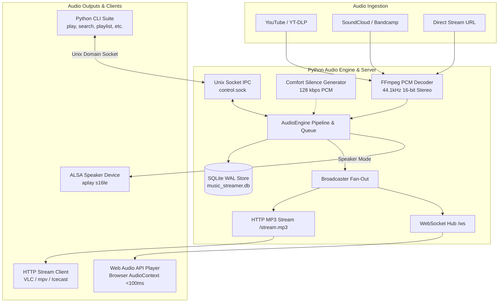

# Music Streamer — System Overview

`music-streamer` is a modular, production-ready audio streaming, decoding, and broadcast platform engineered for Linux (Ubuntu/Debian/Arch). It provides synchronized playback from YouTube, SoundCloud, Bandcamp, or direct media streams simultaneously across local ALSA sound hardware, a 24/7 continuous HTTP MP3 stream, and an ultra-low latency (<50–100ms) WebSocket Web Audio stream.

---

## Key Capabilities & Core Value Proposition

- **Sub-100ms Real-Time Sync via Web Audio API & WebSocket**: Direct raw PCM (44.1 kHz, 16-bit signed stereo) chunks streamed over WebSocket (`/ws`) directly into the browser's `AudioContext` timeline, achieving low-latency lockstep synchronization with the server hardware speaker.
- **24/7 Always-On Live Broadcast**: Continuous HTTP MP3 stream at `http://<SERVER_IP>:8000/stream.mp3` with real-time comfort silence generated during pauses, song transitions, and idle states, preventing client dropouts.
- **Dynamic Hardware Audio Mode Switching**: Switch between `silent` mode (default: network broadcast only) and `speaker` mode (synchronized ALSA hardware speaker output) on the fly without restarting the broadcast daemon.
- **SQLite Database Persistence (WAL Mode)**: Transactional storage (`runtime/music_streamer.db`) for playback queues, fair shuffle cycles, named playlists, settings, and authentication sessions.
- **Two-Tier OTP Authentication**: Role-based access control supporting `Admin` (full playback and library management) and `Subscriber` (streaming and metadata viewing only) roles.
- **Universal Search & Deduplication**: Unified search across local playlists, playback queues, YouTube, SoundCloud, and Bandcamp with typo-tolerant fuzzy matching and duplicate prevention.
- **Next.js Real-Time Web Interface**: Built-in responsive web control panel with glassmorphism aesthetics, live progress tracking, loading skeleton states, playback error diagnostics, and WebSocket event telemetry.

---

## High-Level System Topology



---

## Documentation Sitemap

This documentation suite is organized into dedicated, comprehensive engineering guides:

| Document | Section | Topics Covered |
|---|---|---|
| [01-development.md](file:///home/tech/music-streamer/docs/01-development.md) | **Development Guide** | System prerequisites, virtual environment setup, frontend compilation, test suite execution, debugging, and code conventions. |
| [02-architecture.md](file:///home/tech/music-streamer/docs/02-architecture.md) | **System Architecture** | Subsystem architecture, audio pipeline internals, concurrency model, thread safety, and Unix domain socket IPC. |
| [03-database-and-state.md](file:///home/tech/music-streamer/docs/03-database-and-state.md) | **Database & State Management** | SQLite WAL mode configuration, complete schema specifications, track deduplication, fuzzy token matching, and fair shuffle cycles. |
| [04-audio-engine.md](file:///home/tech/music-streamer/docs/04-audio-engine.md) | **Audio Engine Deep Dive** | PCM chunking calculations (44.1kHz stereo s16le), comfort silence engine, dynamic ALSA/silent mode switching, seeking, and process lifecycle. |
| [05-api-and-websocket.md](file:///home/tech/music-streamer/docs/05-api-and-websocket.md) | **REST API & WebSocket Protocol** | REST endpoint catalog, request/response payloads, RFC 6455 WebSocket framing, binary PCM transport, and telemetry events. |
| [06-cli-reference.md](file:///home/tech/music-streamer/docs/06-cli-reference.md) | **CLI Command Reference** | Complete guide to all CLI tools (`stream.py`, `play.py`, `search.py`, `playback.py`, `playlist.py`, `volume.py`, `loop.py`, `otp.py`, `status.py`, etc.). |
| [07-web-interface.md](file:///home/tech/music-streamer/docs/07-web-interface.md) | **Web Control Panel & Frontend** | Next.js 15 App Router architecture, Web Audio API scheduled buffer decoding, component hierarchy, custom hooks, and UX design. |
| [08-security-and-auth.md](file:///home/tech/music-streamer/docs/08-security-and-auth.md) | **Security & Authentication** | Two-tier OTP authentication (Admin vs Subscriber), session management, timing-safe checks, rate limiting, and cookie/token handling. |
| [09-deployment-and-operations.md](file:///home/tech/music-streamer/docs/09-deployment-and-operations.md) | **Deployment & Operations** | Daemon operation, Cloudflare Tunnel integration, systemd service units, ALSA hardware configuration, logging, and troubleshooting. |

---

## Directory Layout

```
~/music-streamer/
├── docs/                      # Comprehensive engineering documentation suite
│   ├── 00-overview.md
│   ├── 01-development.md
│   ├── 02-architecture.md
│   ├── 03-database-and-state.md
│   ├── 04-audio-engine.md
│   ├── 05-api-and-websocket.md
│   ├── 06-cli-reference.md
│   ├── 07-web-interface.md
│   ├── 08-security-and-auth.md
│   └── 09-deployment-and-operations.md
├── music_streamer/            # Core Python package
│   ├── __init__.py            # Package export
│   ├── config.py              # Central audio constants, paths, and environment settings
│   ├── db.py                  # SQLite WAL database layer and fuzzy search algorithms
│   ├── engine.py              # AudioEngine, Broadcaster, and PCM decoding pipeline
│   ├── ipc.py                 # Unix domain socket IPC client and server
│   ├── playback.py            # Playback list manager, deduplication, and shuffle cycles
│   ├── playlist.py            # Named persistent playlists controller
│   ├── search.py              # Multi-provider music search engine
│   ├── security.py            # Two-tier OTP authentication and session manager
│   ├── server.py              # HTTP server, WebSocket hub, and REST API handlers
│   └── cli.py                 # CLI argument parsing and handler routines
├── web/                       # Next.js 15 & Tailwind CSS Frontend
│   ├── app/                   # App Router pages and global layouts
│   ├── components/            # Modular React UI components
│   ├── hooks/                 # React hooks (useAudioStream, useStreamStatus, etc.)
│   ├── lib/                   # WebSocket client, API client, and utility functions
│   └── out/                   # Pre-built static export served directly by Python server
├── runtime/                   # Dynamic runtime files (git-ignored)
│   ├── music_streamer.db      # SQLite persistent database (WAL mode)
│   ├── control.sock           # IPC Unix domain socket
│   ├── stream_server.pid      # Daemon server process ID file
│   └── stream_server.log      # Broadcast daemon log output
├── tests/                     # Automated unit and integration test suite
│   ├── test_cli.py
│   ├── test_db.py
│   ├── test_engine.py
│   ├── test_ipc_and_server.py
│   ├── test_playback.py
│   ├── test_playlist.py
│   ├── test_search.py
│   ├── test_security.py
│   └── test_web.py
├── stream.py                  # CLI entrypoint: Stream daemon management
├── play.py                    # CLI entrypoint: Direct URL playback
├── play_search.py             # CLI entrypoint: Search & play
├── search.py                  # CLI entrypoint: Music discovery
├── playback.py                # CLI entrypoint: Queue management
├── playlist.py                # CLI entrypoint: Named playlist manager
├── pause.py / resume.py       # CLI entrypoints: Playback state
├── volume.py                  # CLI entrypoint: Volume & mute controls
├── loop.py                    # CLI entrypoint: Repeat mode toggle
├── otp.py                     # CLI entrypoint: OTP security manager
├── status.py                  # CLI entrypoint: System status inspector
├── stop.py                    # CLI entrypoint: Playback & daemon shutdown
└── requirements.txt           # Python package dependencies
```
