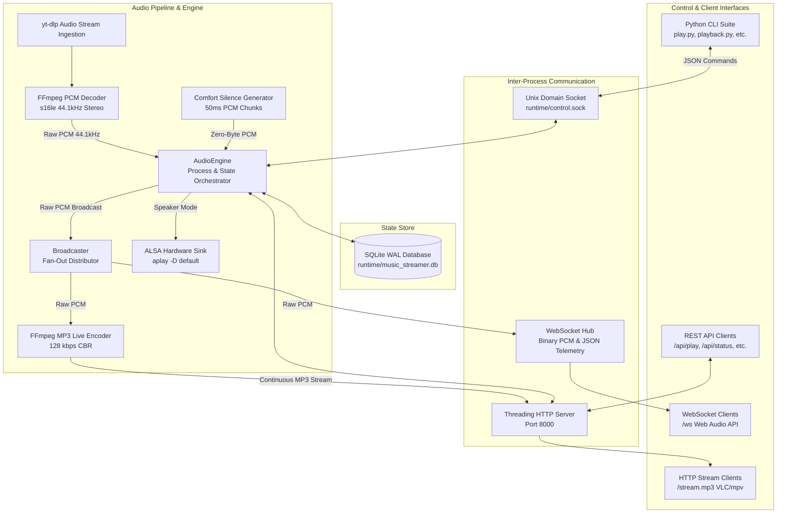
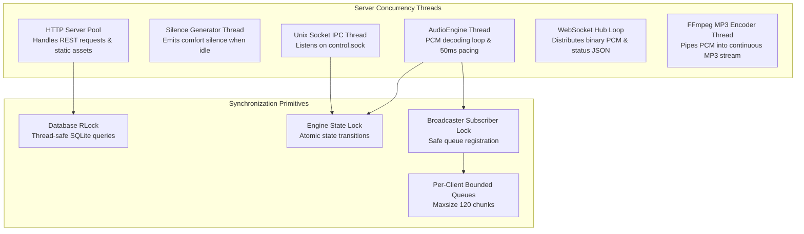
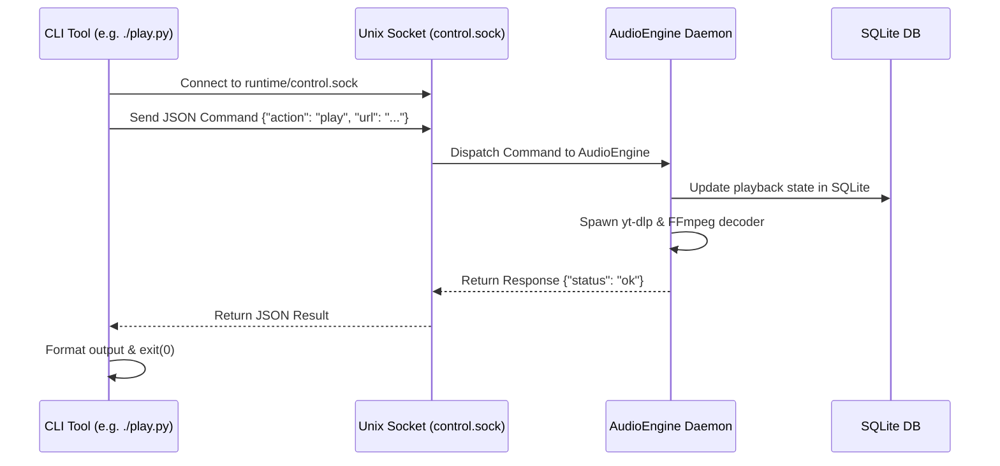

# System Architecture

This document details the architectural design, audio streaming pipeline, concurrency model, and Inter-Process Communication (IPC) mechanisms of `music-streamer`.

---

## 1. System Architecture Overview

`music-streamer` is designed around a decoupled, event-driven audio streaming pipeline backed by an SQLite database state store and synchronized multi-sink audio broadcasting.



---

## 2. The Audio Pipeline

The audio engine guarantees seamless, low-latency audio delivery across multiple output targets simultaneously by centralizing raw PCM audio decoding.

### 2.1 Audio Ingestion & Extraction
1. When a track is requested (via URL or search query), `yt-dlp` extracts the best direct audio stream URL (`bestaudio/best`).
2. Node.js (`NODE_BIN`) executes alongside `yt-dlp` to satisfy YouTube JavaScript player challenges and extract signed streaming tokens.
3. The extracted stream URL is piped into `ffmpeg` without intermediate file downloads.

### 2.2 PCM Decoding Pipeline
The `ffmpeg` decoder process converts any source format (Opus, AAC, WebM, MP4, FLAC) into standard raw PCM:
- **Format**: Signed 16-bit Little-Endian (`s16le`)
- **Sampling Rate**: 44,100 Hz (CD Quality)
- **Channels**: 2 (Stereo)
- **Frame Size**: 4 bytes per frame (2 channels × 2 bytes/sample)

```bash
ffmpeg -reconnect 1 -reconnect_streamed 1 -reconnect_delay_max 5 \
       -ss <OFFSET> -i <AUDIO_URL> \
       -f s16le -acodec pcm_s16le -ac 2 -ar 44100 pipe:1
```

### 2.3 Audio Chunking & Pacing
Audio chunks are read from the decoder stdout in discrete **50ms blocks**:
- **Chunk Frames**: $44,100 \times 0.05 = 2,205\text{ frames}$
- **Chunk Bytes**: $2,205 \times 4\text{ bytes} = 8,820\text{ bytes}$
- **Pacing**: A monotonic high-resolution clock (`time.perf_counter()`) regulates chunk emission every 50ms, ensuring exact wall-clock synchronization across all outputs.

### 2.4 Multi-Sink Fan-Out Broadcaster
Each 50ms PCM chunk is distributed simultaneously to three sinks:
1. **ALSA Hardware Output**: Written directly to `aplay -D <ALSA_DEVICE> -f cd -t raw -q` when the server is in `speaker` mode.
2. **WebSocket Real-Time Stream**: Sent as binary WebSocket frames (`Opcode 0x2`) to connected browser clients for scheduled Web Audio API playback (<50–100ms latency).
3. **Continuous MP3 Broadcast Stream**: Fed into an `ffmpeg` MP3 encoder process (`128 kbps CBR, 44.1kHz stereo`) which outputs continuously to HTTP clients connected to `/stream.mp3`.

---

## 3. Concurrency & Threading Model

The `music-streamer` server uses multi-threaded concurrency to isolate audio decoding, client distribution, network I/O, and IPC command handling:



### 3.1 Thread Safety Mechanisms
- **`Broadcaster.lock`**: Protects the set of active subscriber queues (`queue.Queue`). When an audio chunk arrives, it is placed into each subscriber queue using non-blocking `put_nowait()`. If a client queue is full (slow consumer), the oldest chunk is dropped to prevent memory growth.
- **`DatabaseManager.lock`**: A re-entrant lock (`threading.RLock`) synchronizes access to the SQLite connection pool, guaranteeing thread-safe reads and writes in `WAL` mode.
- **`AudioEngine.lock`**: Serializes playback commands (`play`, `pause`, `resume`, `stop`, `seek`, `skip`, `mode`) so state transitions remain atomic and predictable.

---

## 4. Inter-Process Communication (IPC)

`music-streamer` utilizes a Unix domain socket (`runtime/control.sock`) to allow CLI tools and background daemon processes to communicate synchronously without network overhead.

### 4.1 IPC Message Protocol
Communication over the Unix domain socket is newline-delimited JSON.

**Request Schema:**
```json
{
  "action": "play" | "pause" | "resume" | "stop" | "skip" | "prev" | "seek" | "volume" | "mode" | "status",
  "url": "https://www.youtube.com/watch?v=...",
  "title": "Track Title",
  "seconds": 45.0,
  "value": 80
}
```

**Response Schema:**
```json
{
  "status": "ok" | "error",
  "message": "Playback started",
  "data": { ... }
}
```

### 4.2 IPC Workflow



If the background daemon is not running when a CLI command is executed, the CLI tool detects the missing socket and displays an actionable prompt indicating how to start the stream server (`./stream.py --daemon`).
