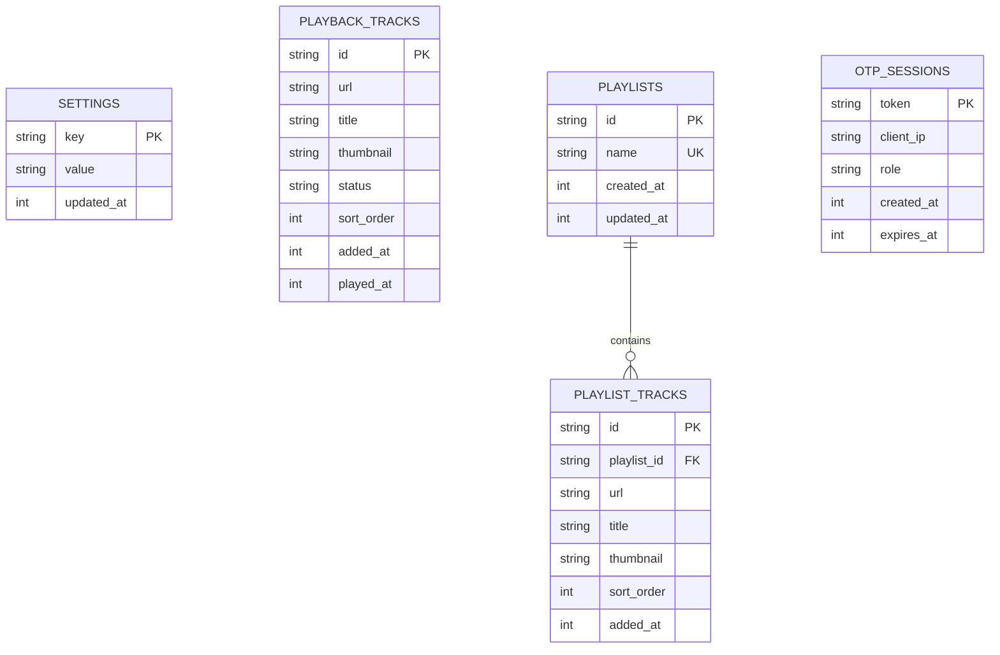
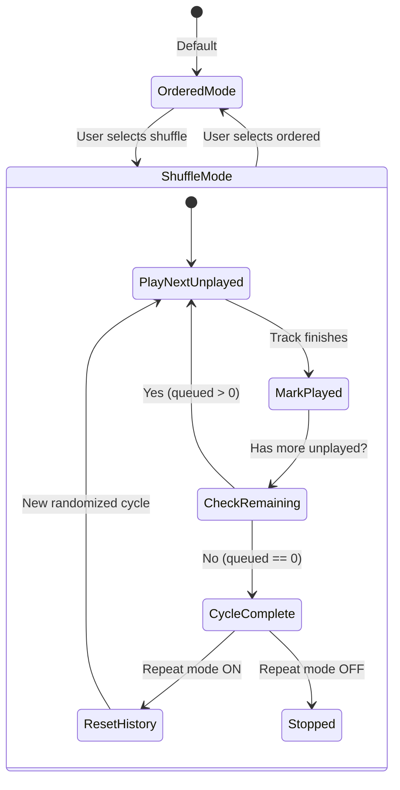

# Database & State Management

This document details the SQLite database layer, schema definitions, deduplication rules, fuzzy token matching algorithms, and shuffle state cycles implemented in `music-streamer`.

---

## 1. SQLite Database Architecture

`music-streamer` uses a high-performance, single-file SQLite database located at `runtime/music_streamer.db`.

### 1.1 Concurrency & WAL Mode
To support concurrent reads from multiple HTTP/WebSocket worker threads alongside writes from the audio engine and CLI tools without table lock contention, SQLite is initialized with the following pragmas:

```sql
PRAGMA journal_mode = WAL;
PRAGMA busy_timeout = 5000;
PRAGMA synchronous = NORMAL;
```

- **Write-Ahead Logging (`WAL`)**: Readers never block writers, and writers never block readers.
- **Busy Timeout (`5000ms`)**: Prevents `SQLITE_BUSY` errors during concurrent bursts by automatically waiting up to 5 seconds for write locks.
- **Synchronous (`NORMAL`)**: Provides durability against application crashes while eliminating synchronous disk flush latency on write operations.

### 1.2 Thread-Safe Connection Management
All database connections are managed through `DatabaseManager.get_connection()` using a re-entrant lock (`threading.RLock`):

```python
@contextmanager
def get_connection(self):
    with self.lock:
        conn = self._get_raw_connection()
        try:
            yield conn
        finally:
            conn.close()
```

---

## 2. Database Schema Reference



### 2.1 Table: `settings`
Stores dynamic server settings, playback configuration, and global state keys.

```sql
CREATE TABLE IF NOT EXISTS settings (
    key TEXT PRIMARY KEY,
    value TEXT NOT NULL,
    updated_at INTEGER NOT NULL
);
```

**Key Default Settings:**
| Key | Default Value | Description |
|---|---|---|
| `state` | `'stopped'` | Current engine state (`'playing'`, `'paused'`, `'stopped'`). |
| `volume` | `'80'` | Global master volume (0–100). |
| `loop` | `'repeat'` | Loop mode (`'repeat'`, `'repeat-one'`, `'off'`). |
| `mode` | `'silent'` | Audio mode (`'silent'` for network stream only, `'speaker'` for ALSA sync). |
| `playback_mode` | `'ordered'` | Queue order mode (`'ordered'` vs `'shuffle'`). |
| `otp_enabled` | `'1'` | OTP passcode security toggle (`'1'` for enabled, `'0'` for disabled). |
| `current_url` | `''` | Direct URL of the currently playing track. |
| `current_title` | `''` | Title of the currently playing track. |
| `current_thumbnail` | `''` | Thumbnail image URL of the currently playing track. |

### 2.2 Table: `playback_tracks`
Maintains the ephemeral playback queue and track history.

```sql
CREATE TABLE IF NOT EXISTS playback_tracks (
    id TEXT PRIMARY KEY,
    url TEXT NOT NULL,
    title TEXT NOT NULL,
    thumbnail TEXT,
    status TEXT NOT NULL,          -- 'queued', 'playing', 'played'
    sort_order INTEGER NOT NULL,
    added_at INTEGER NOT NULL,
    played_at INTEGER
);

CREATE INDEX IF NOT EXISTS idx_playback_status ON playback_tracks(status);
CREATE INDEX IF NOT EXISTS idx_playback_order ON playback_tracks(sort_order);
```

### 2.3 Table: `playlists`
Stores persistent named playlists.

```sql
CREATE TABLE IF NOT EXISTS playlists (
    id TEXT PRIMARY KEY,
    name TEXT UNIQUE NOT NULL COLLATE NOCASE,
    created_at INTEGER NOT NULL,
    updated_at INTEGER NOT NULL
);

CREATE INDEX IF NOT EXISTS idx_playlist_name ON playlists(name);
```

### 2.4 Table: `playlist_tracks`
Stores tracks belonging to specific named playlists with foreign key constraints.

```sql
CREATE TABLE IF NOT EXISTS playlist_tracks (
    id TEXT PRIMARY KEY,
    playlist_id TEXT NOT NULL,
    url TEXT NOT NULL,
    title TEXT NOT NULL,
    thumbnail TEXT,
    sort_order INTEGER NOT NULL,
    added_at INTEGER NOT NULL,
    FOREIGN KEY (playlist_id) REFERENCES playlists(id) ON DELETE CASCADE
);

CREATE INDEX IF NOT EXISTS idx_playlist_id ON playlist_tracks(playlist_id);
CREATE INDEX IF NOT EXISTS idx_playlist_order ON playlist_tracks(playlist_id, sort_order);
```

### 2.5 Table: `otp_sessions`
Manages active web sessions, authenticated client IPs, and role permissions.

```sql
CREATE TABLE IF NOT EXISTS otp_sessions (
    token TEXT PRIMARY KEY,
    client_ip TEXT NOT NULL,
    role TEXT NOT NULL DEFAULT 'admin', -- 'admin' or 'subscriber'
    created_at INTEGER NOT NULL,
    expires_at INTEGER NOT NULL
);

CREATE INDEX IF NOT EXISTS idx_otp_expires ON otp_sessions(expires_at);
```

---

## 3. Data Integrity & Track Deduplication

To prevent duplicate tracks from polluting playback queues and named playlists, strict deduplication rules are enforced at the database layer.

### 3.1 Playback Track Deduplication Algorithm
When adding a track via `db.add_track(url, title, ...)` with `allow_duplicate=False`:
1. The database checks if a record with the same `url` already exists.
2. **If Found**:
   - If the existing track was marked as `'played'` and the incoming status is `'queued'`, its status is reset to `'queued'` (re-enabling replay).
   - If the incoming metadata contains a richer title or thumbnail, the existing record is updated in place.
   - The method returns the existing record with `already_exists=True`.
3. **If Not Found**:
   - A new unique ID is generated (`{timestamp_ms}_{next_order}`).
   - The track is inserted at `COALESCE(MAX(sort_order), -1) + 1`.

### 3.2 Named Playlist Deduplication
Adding a URL to a persistent playlist checks for `(playlist_id, url)` uniqueness. If the track already exists within that specific playlist, the addition is rejected, preventing accidental duplicates.

---

## 4. Fuzzy Token Matching Algorithm

To allow natural language search across local playlists, track names, and artists even with typos, punctuation variations, or smart quotes, `music_streamer.db` implements a multi-stage fuzzy string matching pipeline:

### 4.1 Token Normalization (`normalize_search_tokens`)
1. **Apostrophe / Quote Stripping**: Strips `'`, `’`, `` ` ``, `´`, `"`, `“`, `”` without inserting spaces (`"it's"` $\rightarrow$ `"its"`, `"don't"` $\rightarrow$ `"dont"`).
2. **Punctuation Normalization**: Replaces non-alphanumeric characters with spaces.
3. **Token Extraction**: Extracts word tokens as a `set` alongside the normalized continuous string.

### 4.2 Similarity Scoring Pipeline (`calculate_match_similarity`)

| Match Type | Condition | Score |
|---|---|---|
| **Exact Match** | `query_str == candidate_str` | `1.0` |
| **Substring Match** | `query_str in candidate_str` | `0.95` |
| **Subset Tokens** | `query_tokens.issubset(candidate_tokens)` | `0.90` |
| **Token Overlap** | Ratio of shared tokens between query and candidate | `0.00 – 0.85` |
| **Sliding Window** | Best `SequenceMatcher` ratio across sliding window | `0.00 – 0.88` |

The composite similarity score is calculated as:
$$\text{Score} = \max(\text{Overlap Ratio} \times 0.85,\; \text{Full Sequence Ratio} \times 0.85,\; \text{Best Window Ratio} \times 0.88)$$

---

## 5. Fair Shuffle Cycle Engine

The playback system supports true **fair shuffle cycles** rather than naive random selection, guaranteeing that every track in a collection plays exactly once before any track repeats:



### 5.1 Shuffle Invariant Guarantees
- **History Preservation**: Tracks already marked as `'played'` remain untouched in the history list.
- **Unplayed Randomization**: Only tracks with status `'queued'` have their `sort_order` shuffled using the Fisher-Yates algorithm.
- **Cycle Reset**: When all tracks reach `'played'` status with `loop=repeat`, `reset_track_history()` resets all statuses back to `'queued'` and triggers a fresh randomized cycle.
