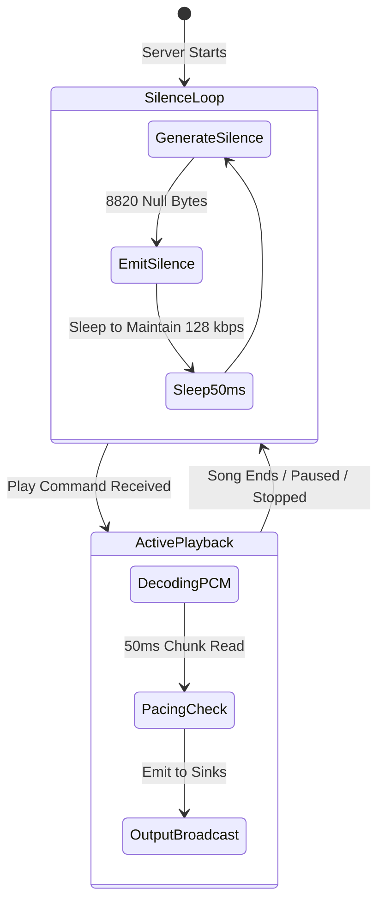
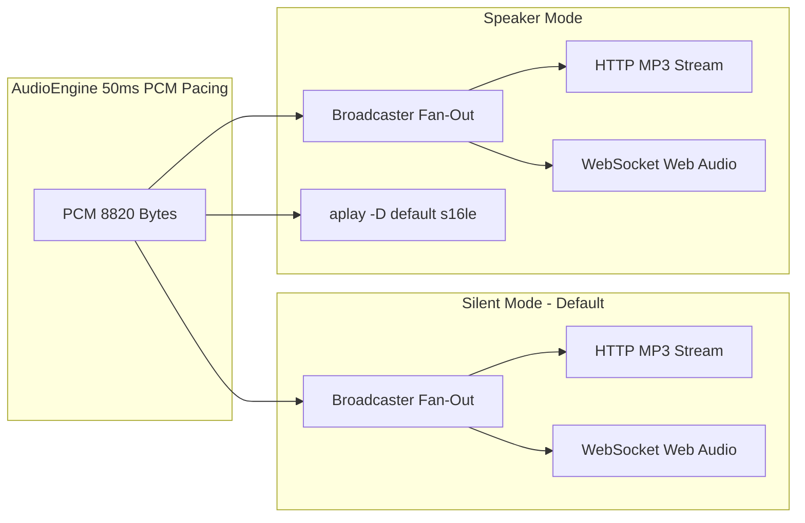
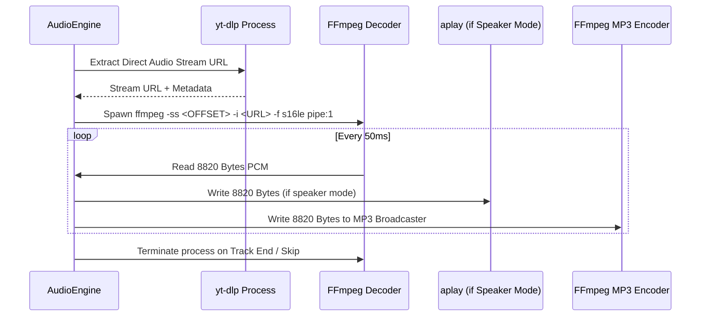

# Audio Engine Deep Dive

This document provides a deep technical analysis of the `music_streamer.engine` audio pipeline, audio synchronization math, comfort silence generation, dynamic hardware mode switching, seeking calculations, and process lifecycle management.

---

## 1. Audio Specifications & Mathematical Constants

All audio within `music-streamer` is normalized and decoded to uncompressed CD-quality raw Pulse-Code Modulation (PCM).

```
Sample Rate:        44,100 Hz (44.1 kHz)
Channels:           2 (Stereo: Left, Right)
Sample Format:      Signed 16-bit Little-Endian (s16le)
Bytes per Sample:   2 bytes (16 bits)
Bytes per Frame:    4 bytes (2 channels × 2 bytes)
```

### 1.1 Chunk Sizing & Timing Math

The engine operates on discrete **50ms (0.05s)** chunks for low-latency synchronization:

$$\text{Frames per Chunk} = 44,100\text{ samples/sec} \times 0.05\text{ sec} = 2,205\text{ frames}$$

$$\text{Bytes per Chunk} = 2,205\text{ frames} \times 4\text{ bytes/frame} = 8,820\text{ bytes}$$

$$\text{Silence Chunk} = \underbrace{\mathtt{0x00\ 0x00\ \dots\ 0x00}}_{8,820\text{ bytes}}$$

```python
SAMPLE_RATE = 44100
CHANNELS = 2
BYTES_PER_SAMPLE = 2
BYTES_PER_FRAME = CHANNELS * BYTES_PER_SAMPLE  # 4 bytes
CHUNK_FRAMES = 2205                            # 50ms chunks
CHUNK_BYTES = CHUNK_FRAMES * BYTES_PER_FRAME   # 8820 bytes
CHUNK_DURATION = 0.05                          # seconds
SILENCE_CHUNK = b"\x00" * CHUNK_BYTES
```

---

## 2. 24/7 Comfort Silence Generator

HTTP live streams (e.g. VLC, mpv, browser `<audio>`) and WebSocket audio buffers will drop connections or stutter if the byte stream stops during track transitions, buffering delays, or when playback is paused or stopped.



### 2.1 Silence Generation Invariants
- When no music is active, the engine continuously outputs `SILENCE_CHUNK` (8,820 null bytes) every 50ms.
- Remote HTTP listeners remain connected indefinitely at a constant bit rate (128 kbps CBR MP3).
- Web Audio API clients receive continuous zero-energy PCM blocks, keeping the browser audio pipeline primed and synchronized without pops or clicks.

---

## 3. Dynamic Mode Switching: Silent vs. Speaker

`music-streamer` allows instant zero-downtime switching between server hardware speaker output and network-only streaming without restarting the server or interrupting connected listeners.



### 3.1 Mode Comparison

| Feature | Silent Mode (Default) | Speaker Mode |
|---|---|---|
| **Server Hardware Speaker** | Completely silent (ALSA process closed/suspended). | Active via `aplay` (CD raw PCM). |
| **HTTP Stream (`/stream.mp3`)** | Active (128 kbps MP3). | Active (128 kbps MP3). |
| **WebSocket (`/ws`)** | Active (<50–100ms raw PCM). | Active (<50–100ms raw PCM). |
| **Use Case** | Remote listening, server in quiet environment/datacenter. | Local listening with synchronized remote speakers. |

### 3.2 Dynamic Transition Mechanics
Switching mode via `./stream.py speaker` or `./stream.py silent` (or via Web UI) updates the SQLite `mode` setting and notifies the running `AudioEngine`. If switching to `speaker` mode, the engine dynamically spawns the `aplay` worker process and attaches it to the active PCM chunk distributor. If switching to `silent`, `aplay` is cleanly terminated without dropping audio frames to network listeners.

---

## 4. Subprocess Pipeline & Lifecycle Management

To decode audio efficiently without loading full tracks into RAM, `music-streamer` manages a chained process pipeline:



### 4.1 Process Isolation & Zombie Prevention
When a track is skipped, interrupted, or stopped, child processes are terminated using process groups:
```python
def _kill_process_tree(proc: subprocess.Popen):
    try:
        os.killpg(os.getpgid(proc.pid), signal.SIGTERM)
        proc.wait(timeout=2.0)
    except (subprocess.TimeoutExpired, ProcessLookupError):
        try:
            os.killpg(os.getpgid(proc.pid), signal.SIGKILL)
        except ProcessLookupError:
            pass
```

---

## 5. Seeking & Progress Tracking

The engine tracks playback progress and duration using high-precision monotonic timers and chunk counters.

### 5.1 Elapsed Time Calculation
$$\text{Elapsed Seconds} = \text{Elapsed Offset} + (\text{Chunks Played} \times 0.05\text{s})$$

### 5.2 Seeking Implementation
When seeking to a new position (e.g. `/api/seek` with `seconds=120` or `delta=+15`):
1. The engine terminates the active `ffmpeg` decoding process.
2. The `elapsed_offset` is set to the target position.
3. A new `ffmpeg` decoder is spawned with `-ss <TARGET_SECONDS>` prepended to the input arguments for fast keyframe seeking.
4. Continuous comfort silence is streamed to listeners during the 100–300ms seek transition, preventing audio dropouts.
