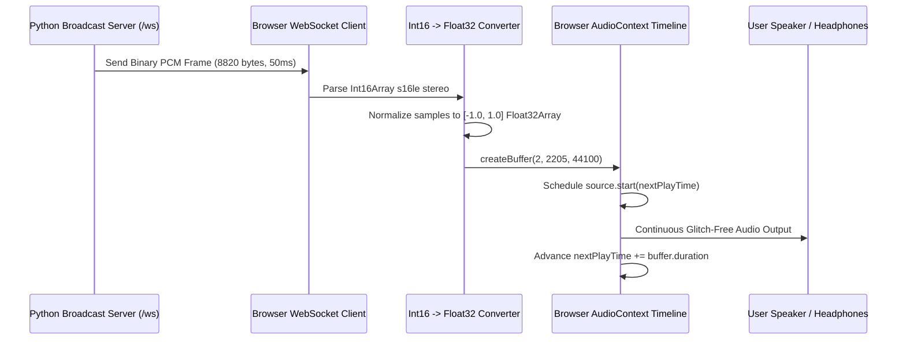

# Web Control Panel & Frontend Architecture

This document covers the frontend architecture, Web Audio API scheduled streaming engine, component hierarchy, custom hooks, and user experience design of the `music-streamer` web application (`web/`).

---

## 1. Frontend Architecture & Technology Stack

The web interface is built using modern web standards and compiled to a zero-dependency static bundle:

- **Framework**: Next.js 15 (App Router)
- **UI Library**: React 19
- **Styling**: Tailwind CSS with custom glassmorphism effects
- **Audio Decoding**: Web Audio API (`AudioContext`, `GainNode`, `AudioBufferSourceNode`)
- **Real-Time Communication**: WebSocket RFC 6455 binary and text streaming
- **Icons**: Lucide React
- **Export Target**: Static HTML/JS bundle (`next.config.ts` with `output: 'export'`), served directly by the Python HTTP server from `web/out/`.

---

## 2. Web Audio API Low-Latency Streaming Engine (`useAudioStream.ts`)

Standard HTML5 `<audio src="/stream.mp3">` elements introduce a **2–3 second buffer delay**. To achieve true **sub-100ms lockstep synchronization** with the server hardware speaker, `music-streamer` streams raw PCM over WebSocket directly into browser Web Audio API scheduled buffers:



### 2.1 Audio Conversion Pipeline
When a binary WebSocket frame arrives:
1. It is wrapped in an `Int16Array` (interleaved stereo: `[L0, R0, L1, R1, ...]`).
2. Converted to two planar `Float32Array` buffers (Left and Right channels):
   $$\text{Sample}_{\text{Float32}} = \frac{\text{Sample}_{\text{Int16}}}{32,768.0}$$
3. Loaded into a dual-channel `AudioBuffer` at `44,100 Hz`.

### 2.2 Scheduled Jitter Buffer & Drift Correction
To ensure uninterrupted audio without clicks, underruns, or overlapping echoes:
- **Target Lead Buffer**: `200ms` (`0.20s`) lead time protects against network packet jitter.
- **Drift / Tab Freeze Correction**: If the browser tab was backgrounded and `nextPlayTime` falls behind `currentTime` or exceeds `currentTime + 2.0s`, the playback cursor is reset cleanly to `currentTime + targetLead`.
- **Latency Monitoring**: The hook computes live latency in milliseconds:
  $$\text{Latency (ms)} = \max(0, (\text{scheduledTime} - \text{currentTime}) \times 1000)$$

---

## 3. Component Hierarchy

```
web/
├── app/
│   ├── globals.css              # Glassmorphic utilities & animations
│   ├── layout.tsx               # Root layout & ToastProvider
│   └── page.tsx                 # Main application dashboard
├── components/
│   ├── Header.tsx               # Brand logo, connection pill, role badge & theme
│   ├── TopProgressBar.tsx       # Top-edge page loading indicator
│   ├── PlaybackErrorBanner.tsx  # Track playback error alert with Retry/Skip actions
│   ├── NowPlayingHero.tsx       # Glassmorphic turntable, progress bar, audio transport
│   ├── StreamPlayer.tsx         # Live Web Audio sync player bar & volume
│   ├── UniversalSearchBar.tsx   # Header quick search bar
│   ├── UniversalSearchModal.tsx # Unified local vs web search modal
│   ├── PlaybackList.tsx         # Ephemeral playback queue with reordering
│   ├── PlaylistExplorer.tsx     # Saved named playlists explorer
│   ├── SaveToPlaylistModal.tsx  # Modal to save current/queued track to playlist
│   ├── StatusGrid.tsx           # Telemetry metrics (listeners, ALSA mode, latency)
│   ├── SecurityOtpModal.tsx     # 6-digit OTP passcode authentication dialog
│   └── ToastNotification.tsx    # Floating notification alerts
```

---

## 4. Custom React Hooks

### 4.1 `useStreamStatus`
Subscribes to the WebSocket status channel with automatic REST polling fallback:
- Listens for real-time `status` and `track_change` events.
- Tracks `isPlaying`, `isBuffering`, `currentTrack`, `elapsed`, `duration`, `volume`, `loop`, `mode`, and queue track lists.
- Dynamically estimates smooth elapsed playback progress between server sync ticks.

### 4.2 `useAudioStream`
Controls the local browser audio playback lifecycle:
- Initializes and manages the browser `AudioContext` singleton.
- Subscribes to binary PCM chunks from `wsClient`.
- Provides local volume and mute controls via an `AudioContext` `GainNode`.
- Measures and reports real-time latency status in milliseconds.

### 4.3 `useAuth`
Manages user authentication and role state:
- Reads and stores session tokens in cookies / local storage.
- Tracks `isAuthenticated`, `securityEnabled`, and current `role` (`admin` vs `subscriber`).
- Provides `verifyOtp(otpCode)` and `logout()` helper functions.

---

## 5. UI & UX Aesthetics

- **Glassmorphic Theme**: Dark background (`#0b0f19`) with translucent frosted-glass panels (`backdrop-blur-md bg-slate-900/60 border border-slate-800/80`).
- **Dynamic Vinyl Visualization**: Rotating record animation with real-time album artwork that accelerates when playing and pauses smoothly when paused.
- **Diagnostics & Error Recovery**: When a track fails to decode (e.g. geo-restricted or deleted YouTube video), an inline error banner appears with diagnostic details and one-click **Retry** and **Skip Next** action buttons.
- **Responsive Layout**: Adapts smoothly from desktop widescreen dashboards to mobile touch interfaces.
